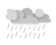

Welcome back to our Weatherful Weather application development series...


In this lesson...
- Setting up the current weather using some sample data, structured as an object
   - Selecting elements and then manipulating them using their properties and methods
- Then, converting the temperature between units, celsius and fahrenheit
   - Utilizing event listeners, functions, and applying other javascript concepts from our lessons so far.

So if you're ready, let's dive into our code...


# Current temp

<!-- *************************************** -->
1. Attach JS
- Test with console.log(`Hello world`)
- Check in browser

<!-- *************************************** -->
1. Bring in sample dataset
```js
let current = {
	time: {
		hour: 14,
		minute: 25,
		light: "day"
	},
	condition: {
		desc: "Get your shovels ready, Toronto. Today it's going to snow!",
		type: "snow"
	},
	temp: 0,
	high: 3,
	low: -1
}
```
- Explain the subobjects
  - Time will refer to the local time and will change the image based on the time of day
  - Condition will tell us what the weather looks like
  - Combine together to create graphics


<!-- *************************************** -->
3. Empty out the HTML content (don't forget `value`)
- Remove image srset


<!-- *************************************** -->
4. Create `setCurrentWeather`, will parse our live data

```js
let setCurrentWeather = (data) => {

}
setCurrentWeather(current)
```


<!-- *************************************** -->
5. Selectors
```js
let tempEle = document.querySelector(`#currTemp`)
let highEle = document.querySelector(`#highTemp`)
let lowEle = document.querySelector(`#lowTemp`)
```


<!-- *************************************** -->
6. Set values

```js
// TODO: Explain the different between textContent and innerHTML
// TODO: Option + shift + 8 = °,   Windows: Alt + 0176
// Current temp
tempEle.innerHTML = `${data.temp}&deg;<abbr title="Degrees celsius" class="unit">C</abbr>` //! HERE
tempEle.setAttribute(`value`, data.temp)

// Daily high
highEle.innerHTML = `${data.high}&deg;`
highEle.setAttribute(`value`, data.high)

// Daily low
lowEle.innerHTML = `${data.low}&deg;`
lowEle.setAttribute(`value`, data.low)
```


<!-- *************************************** -->
7. Condition 

```js
let desc = document.querySelector(`#desc`)

// Assign the weather description
desc.textContent = data.condition.desc
```

<!-- *************************************** -->
8. Images

```js
let iconSm = document.querySelector(`#iconSm`)
let iconLg = document.querySelector(`#iconLg`)

// Condition image (large)
// iconLg.setAttribute(`srcset`, `img/day-snow-lg.svg`)
iconLg.setAttribute(`srcset`, `img/${data.time.light}-${data.condition.type}-lg.svg`)

// Condition image (small)
iconSm.setAttribute(`src`, `img/${data.time.light}-${data.condition.type}-sm.svg`)
iconSm.setAttribute(`alt`, data.condition.desc)
```


----


# Conversion


<!-- *************************************** -->
1. Add ids and selectors

```js
// Select the unit buttons
let setF = document.querySelector(`#setF`)
let setC = document.querySelector(`#setC`)

setC.classList.add(`active`)
```

<!-- *************************************** -->
3. Add event listeners

```js
let displayMetricUnits = () => {
}
let displayImperialUnits = () => {
}

setC.addEventListener(`click`, displayMetricUnits)
setF.addEventListener(`click`, displayImperialUnits)
```

<!-- *************************************** -->
4. Swap actives to test out the functions...

```js
let displayMetricUnits = () => {
   setF.classList.remove(`active`)
	setC.classList.add(`active`)
}
let displayImperialUnits = () => {
   setC.classList.remove(`active`)
	setF.classList.add(`active`)
}
```

<!-- *************************************** -->
5. Convert the main unit

```js
let displayImperialUnits = () => {
   setC.classList.remove(`active`)
	setF.classList.add(`active`)

   let currValue = tempEle.getAttribute(`value`)
   let newValue = currValue * 9/5 + 32

   tempEle.setAttribute(`value`, newValue)
   tempEle.innerHTML = `${Math.round(newValue)}&deg;<abbr title="Degrees fahrenheit" class="unit">F</abbr>`
}
```
**PROBLEM**  We have to repeat this for each temp! (too many with table)


<!-- *************************************** -->
6. Create a function to do this...

```js
let toFahrenheit = (celsius) => {
  return celsius * 9/5 + 32
}
let setTempToUnit = (ele) {                        ///// HERE FIRST
   let currValue = ele.getAttribute(`value`)
   let newValue = toFahrenheit(currValue)  /// NOW THE FUNCTION

   ele.setAttribute(`value`, newValue)
   ele.innerHTML = `${Math.round(newValue)}&deg;<abbr title="Degrees fahrenheit" class="unit">F</abbr>`
}
let displayImperialUnits = () => {
   setC.classList.remove(`active`)
   setF.classList.add(`active`)
   setTempToUnit(tempEle)
   setTempToUnit(highEle)
   setTempToUnit(lowEle)
}
```
**PROBLEM**  What about back to celsius?  (Nevermind the unit on the end for now.)
"We *could* just have two functions for this..."

<!-- *************************************** -->
1. Show that function can be passed...

```js
let setTempToUnit = (ele, toUnit) {                        ///// HERE FIRST
   //...
   let newValue = toUnit(currValue)  /// NOW THE FUNCTION
   //...
}
let displayImperialUnits = () => {
   // ...
   setTempToUnit(tempEle, toFahrenheit)
   setTempToUnit(highEle, toFahrenheit)
   setTempToUnit(lowEle, toFahrenheit)
}
```


<!-- *************************************** -->
8. Now do it for C

```js
// Convert from F to C
let toCelsius = (fahrenheit) => {
  return (fahrenheit - 32) * 5/9
}
//...
```


<!-- *************************************** -->
9. Move the tail to the outside.

```js
let setTempToUnit = (ele, toUnit, unit=``) => {  // Default param
   //...
   ele.innerHTML = `${Math.round(newValue)}&deg;${unit}`
}

let displayMetricUnits = () => {  // FOR EXAMPLE
	setTempToUnit(tempEle, toCelsius, `<abbr title="Degrees celsius" class="unit">C</abbr>`)
	setTempToUnit(highEle, toCelsius)
	setTempToUnit(lowEle, toCelsius)
}
```


<!-- *************************************** -->
10. Remove listeners to avoid accumulation

```js
let displayMetricUnits = () => {
	setF.classList.remove(`active`)
	setC.classList.add(`active`)
	setC.removeEventListener(`click`, displayMetricUnits)
   setF.addEventListener(`click`, displayImperialUnits)
   // ...
}
let displayImperialUnits = () => {
	setC.classList.remove(`active`)
	setF.classList.add(`active`)
	setF.removeEventListener(`click`, displayImperialUnits)
   setC.addEventListener(`click`, displayMetricUnits)
   // ...
}
```

# Final code

## HTML

```html
<!DOCTYPE html>
<html lang="en">
  <head>
    <meta charset="utf-8">
    <meta name="viewport" content="width=device-width, initial-scale=1.0">
    <title>Weatherful Weather</title>
    <meta name="description" content="A weatherful weather application interface">
    <link rel="stylesheet" href="css/style.css">
  </head>
  <body>
    <div class="layout">
      <header class="header container">
        <a href="index.html" class="logo"></a>
        <ul class="no-markers units">
          <li><button class="btn" id="setC"><abbr title="Degrees celsius">C</abbr></button></li>
          <li><button class="btn" id="setF"><abbr title="Degrees fahrenheit">F</abbr></button></li>
        </ul>
      </header>
      <main class="container weather">
        <article class="current">
          <picture>
            <source srcset="" media="(min-width: 50rem)" id="iconLg">
            
          </picture>
          <h1 class="heading">Current Conditions</h1>
          <p class="desc" id="desc"></p>
          <data value="" class="temp" id="currTemp"></data>
          <ul class="no-markers high-low">
            <li class="low">
              
              <data value="" id="highTemp"></data>
            </li>
            <li class="high">
              <data value="" id="lowTemp"></data>
              
            </li>
          </ul>
        </article>
        <aside class="forecast">
          <ul class="no-markers tabs">
            <li><button class="btn active">Hourly</button></li>
            <li><button class="btn">Tomorrow</button></li>
            <li><button class="btn">Week</button></li>
          </ul>
          <table class="ranges">
            <thead>
              <tr>
                <th>Time</th>
                <th>Conditions</th>
                <th><abbr title="Probability of precipitation">PoP</abbr></th>
                <th><abbr title="Temperature">Temp</abbr></th>
              </tr>
            </thead>
            <tbody class="range">
              <tr>
                <td>3:00 pm</td>
                <td></td>
                <td>100%</td>
                <td class="range-temp"><data value="-1">-1&deg;</data></td>
              </tr>
              <tr>
                <td>4:00 pm</td>
                <td></td>
                <td>90%</td>
                <td class="range-temp"><data value="0">0&deg;</data></td>
              </tr>
              <tr>
                <td>5:00 pm</td>
                <td></td>
                <td>80%</td>
                <td class="range-temp"><data value="0">0&deg;</data></td>
              </tr>
              <tr>
                <td>6:00 pm</td>
                <td></td>
                <td>50%</td>
                <td class="range-temp"><data value="1">1&deg;</data></td>
              </tr>
              <tr>
                <td>7:00 pm</td>
                <td></td>
                <td>25%</td>
                <td class="range-temp"><data value="1">1&deg;</data></td>
              </tr>
              <tr>
                <td>8:00 pm</td>
                <td></td>
                <td>10%</td>
                <td class="range-temp"><data value="2">2&deg;</data></td>
              </tr>
              <tr>
                <td>9:00 pm</td>
                <td></td>
                <td>0%</td>
                <td class="range-temp"><data value="2">2&deg;</data></td>
              </tr>
              <tr>
                <td>10:00 pm</td>
                <td></td>
                <td>0%</td>
                <td class="range-temp"><data value="3">3&deg;</data></td>
              </tr>
            </tbody>
          </table>
        </aside>
      </main>
      <footer class="footer">
        <div class="container footer-group">
          <p class="tagline">It's not always wonderful, but it is always Weatherful!</p>
          <p class="madeby">Created with ❤️ by You!</p>
        </div>
      </footer>
    </div>

    <script src="js/script.js"></script>
  </body>
</html>
```

```css
@import url('https://fonts.googleapis.com/css2?family=Roboto:wght@400;700&display=swap');

* {
  box-sizing: border-box;
}

:root {
  --col-a: rgb(255, 255, 247);
  --col-b: rgb(177, 213, 255);
  --col-c: rgb(184, 187, 205);
  --shade-dark: rgba(0, 0, 0, 0.1);
  --shade-light: rgba(255, 255, 255, 0.1);
}
html {
  height: 100%;
}
body {
  background-color: rgb(90, 154, 232);
  background-image:
    repeating-linear-gradient(
      45deg,
      rgba(255,255,255,0.03) 0,
      rgba(255,255,255,0.03) 1px,
      transparent 1px,
      transparent 4px
    ),
    linear-gradient(
      rgb(90, 154, 232), 
      rgb(21, 101, 162)
    );
  background-attachment: fixed;
  font: normal 400 1rem/1 'Roboto', helvetica, arial, sans-serif;
  color: var(--col-a);
  text-align: center;
  height: 100%;
  margin: 0;
}

.layout {
  display: flex;
  flex-direction: column;
  min-height: 100%;
}

/******** UTILITY ********/
.container {
  width: 100%;
  max-width: 70rem;
  padding: 0 1rem;
  margin: 0 auto;
}
.no-markers {
  list-style-type: none;
  padding: 0;
}
.btn {
  background-color: transparent;
  font: normal 400 1rem/1 'Roboto', helvetica, arial, sans-serif;
  color: var(--col-a);
  padding: 0.75rem 1rem;
  border: 3px solid transparent;
  border-radius: 0.25rem;
}
.btn:hover {
  background-color: var(--shade-light);
}
.btn:focus {
  background-color: var(--shade-light);
  border-color: var(--col-b);
  outline: none;
}
.btn.active {
  border-color: var(--col-a);
  font-weight: 700;
}

/******** HEADER ********/
.header {
  display: flex;
  justify-content: space-between;
}
.logo {
  margin: 1rem 1rem 1rem 0;
}
.units {
  display: flex;
}


/******** WEATHER ********/
.weather {
  flex-grow: 1;
}
/******** CURRENT ********/
.current {
  max-width: 20rem;
  margin: 0 auto;
}
.current::after {
  content: "";
  display: block;
  background-image: url('../img/squiggly-line.svg');
  background-repeat: no-repeat;
  background-position: center center;
  height: 1rem;
  margin: 2rem 0;
}
.heading {
  font-size: 1rem;
  color: var(--col-b);
  text-transform: uppercase;
}
.desc {
  font-size: 1.25rem;
}
.temp {
  display: block;
  font-size: 2.75rem;
  font-weight: 700;
  margin: 1rem 0;
}
.unit {
  font-size: 2rem;
}
.high-low {
  font-size: 2rem;
}
.low {
  color: var(--col-b);
  display: inline;
}
.high {
  display: inline;
}

/******** FORECAST ********/
.tabs {
  display: flex;
  justify-content: space-around;
}
.ranges {
  background-color: var(--shade-dark);
  width: 100%;
  padding: 1rem;
  border-radius: 0.5rem;
  margin: 1rem 0;
  border-spacing: 0;
}
.ranges th {
  font-weight: 400;
  color: var(--col-b);
  line-height: 2;
}
.range tr:hover {
  background-color: var(--shade-dark);
}
.range {
  font-size: 1.25rem;
}
.range-temp {
  font-size: 1.5rem;
  font-weight: 700;
}

/******** FOOTER ********/
.footer {
  background-color: var(--shade-dark);
  color: var(--col-c);
  line-height: 1.5;
  padding: 1rem 0 2rem 0;
  margin-top: 2rem;
}
.tagline, .madeby {
  margin: 0;
}

@media screen and (min-width: 50rem) {
  .weather {
    display: flex;
  }
  .current {
    max-width: none;
    flex-grow: 1;
    margin-right: 2rem;
  }
  .ranges {
    min-width: 25rem;
  }
  .footer {
    padding: 1rem 0;
    line-height: 1;
  }
  .footer-group {
    display: flex;
    justify-content: space-between;
  }
}
```

## JS

```js
//******* SAMPLE DATA SET ******* 
let current = {
	time: {
		hour: 14,
		minute: 25,
		light: "day"
	},
	condition: {
		desc: "Get your shovels ready, Toronto. Today it's going to snow!",
		type: "snow"
	},
	temp: 0,
	high: 3,
	low: -1
}


//******* SELECTED ELEMENTS ******* 
let tempEle = document.querySelector(`#currTemp`)
let highEle = document.querySelector(`#highTemp`)
let lowEle = document.querySelector(`#lowTemp`)
let descEle = document.querySelector(`#desc`)
let iconSm = document.querySelector(`#iconSm`)
let iconLg = document.querySelector(`#iconLg`)


//******* CURRENT TEMP ******* 
let setCurrentWeather = (data) => {

  // Assign the current day's temp
  tempEle.innerHTML = `${data.temp}&deg;<abbr title="Degrees celsius" class="unit">C</abbr>`
  tempEle.setAttribute(`value`, data.temp)

  highEle.innerHTML = `${data.high}&deg;`
  highEle.setAttribute(`value`, data.high)

  lowEle.innerHTML = `${data.low}&deg;`
  lowEle.setAttribute(`value`, data.low)

  // Assign the weather condition
  descEle.textContent = data.condition.desc

  // Condition image (large)
  iconLg.setAttribute(`srcset`, `img/${data.time.light}-${data.condition.type}-lg.svg`)

  // Condition image (small)
  iconSm.setAttribute(`src`, `img/${data.time.light}-${data.condition.type}-sm.svg`)
  iconSm.setAttribute(`alt`, data.condition.desc)
}

// Execute
setCurrentWeather(current) // Dataset for Toronto weather


//////////////////////////////////////////////////


//******* SELECTED ELEMENTS ******* 
let setC = document.querySelector(`#setC`)
let setF = document.querySelector(`#setF`)


// Convert F to C
let toCelsius = (fahrenheit) => {
  return (fahrenheit - 32) * 5/9
}

// Convert C to F
let toFahrenheit = (celsius) => {
  return celsius * 9/5 + 32
}

let setTempToUnit = (ele, toUnit, unit=``) => {
  let currValue = ele.getAttribute(`value`)
  let newValue = toUnit(currValue)

  // Set the new value to the value attribute of the data element
  ele.setAttribute(`value`, newValue)
  // Assign the rounded temp to the UI
  ele.innerHTML = `${Math.round(newValue)}&deg;${unit}`
}


let displayMetricUnits = () => {
  setF.classList.remove(`active`)
  setC.classList.add(`active`)

  // Move the event listeners
  setC.removeEventListener(`click`, displayMetricUnits)
  setF.addEventListener(`click`, displayImperialUnits)

  // Do the conversions
  setTempToUnit(tempEle, toCelsius, `<abbr title="Degrees celsius" class="unit">C</abbr>`)
  setTempToUnit(highEle, toCelsius)
  setTempToUnit(lowEle, toCelsius)
}


let displayImperialUnits = () => {
  // Move the "active" UI
  setC.classList.remove(`active`)
  setF.classList.add(`active`)

  // Move the event listeners
  setF.removeEventListener(`click`, displayImperialUnits)
  setC.addEventListener(`click`, displayMetricUnits)

  // Do the conversions
  setTempToUnit(tempEle, toFahrenheit, `<abbr title="Degrees fahrenheit" class="unit">F</abbr>`)
  setTempToUnit(highEle, toFahrenheit)
  setTempToUnit(lowEle, toFahrenheit)
}

// Execute
setC.classList.add(`active`)
setF.addEventListener(`click`, displayImperialUnits) // F

```
